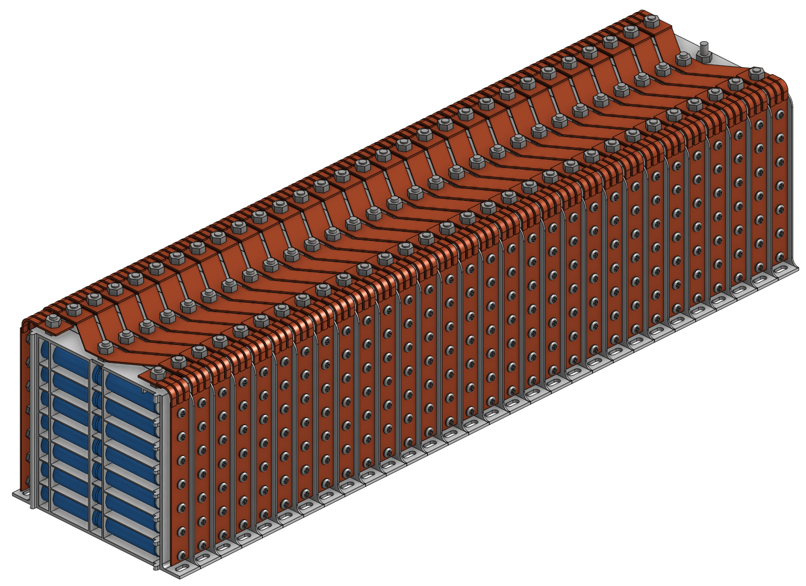

# Electrical System Overview

A general guide to understanding how all of the car’s electrical systems work together.

!!! info
    This page is intended to build your understanding of the car’s electrical systems, rather than serve as a precise reference for exact specifications. Some illustrations may include outdated information alongside future designs, so please interpret them as conceptual rather than definitive.

---

## Introduction

This page provides a high-level summary of the solar car’s electrical system. More detailed information about each subsystem can be found in the individual pages linked throughout this wiki.

The car’s electronics are organized into three main sections:

1.  **High Voltage**  
    The high-voltage system powers the car’s drivetrain and manages energy storage for propulsion. It includes components such as the battery pack and the motor controller.
2.  **Low Voltage**  
    The low-voltage system supports all auxiliary and control electronics. This includes lighting (brake lights, blinkers, etc.), telemetry, data logging, and other supporting subsystems that keep the car functional and safe.
3.  **Solar Array**  
    The solar array serves as the car’s primary energy source. It converts sunlight into electrical power, which can be used to drive the vehicle directly or charge the battery pack for later use. The array’s performance and behavior are managed through dedicated electronics that handle power optimization, protection, and data monitoring.

---

## Electrical System Overview

This diagram illustrates the major electrical components of the car and their key interconnections.  
Data is transmitted across the vehicle primarily through the CAN Bus, which links the various control modules. In addition, some components communicate using low-voltage signals for simpler or direct connections.  
Both high-voltage and low-voltage power paths are also shown to highlight how energy and signals flow throughout the system.

---

## High Voltage (HV)

### Battery box

The battery box is the heart of the car’s electrical system. It contains all of the battery cells, the battery management system, and the battery control module, which oversees all battery operations and communication.

To manage high-voltage power, the box includes multiple contactors that control power flow to and from the pack. A pre-charge circuit is also built in to safely energize loads, preventing damage due to high inrush currents.

Finally, the battery box serves as the source for the car’s low-voltage power, supplying energy for control electronics, lighting, and other auxiliary systems.

### Battery Pack

This image shows an older battery pack from _Nova_, which was also used on _Orion_ in FSGP 2025. It consists of 420 cylindrical 18650 Li-ion cells arranged in a 30s14p configuration—meaning each module contains 14 cells in parallel, and there are 30 modules connected in series.

### Battery Management System (BMS)

This diagram illustrates how the battery pack is monitored using a commercial off-the-shelf (COTS) Battery Management System.

The BMS interfaces directly with the Battery Pack Control Module, providing real-time information on voltage, current, and temperature to ensure the safe operation of the battery pack.

### Battery Control Module (BCM)

The Battery Control Module acts as the interface between the driver’s inputs and the Battery Management System, ensuring that contactors are opened and closed safely to manage high-voltage power.

The BCM also integrates key safety functions, including:

- Emergency Stop (E-Stop) circuitry: Immediately shuts down the car in the event of an E-Stop.
- BMS strobe indicators: Provide visual feedback to the driver and nearby personnel about the status of BMS faults.

Through these functions, the BCM ensures both safe operation of the battery pack and clear communication of system health to the driver.

### Propulsion

The propulsion system is what drives the car forward. It consists of a motor controller that manages a brushless DC (BLDC) hub motor mounted in the rear wheel.

The driver controls motor power and speed using a combination of switches and an accelerator pedal, which send input signals to the motor controller. The controller then regulates torque and speed based on these inputs and vehicle conditions.

The system also supports regenerative braking, allowing the motor to act as a generator during deceleration and return energy to the battery pack. However, care must be taken to ensure the battery pack is capable of accepting charge before regeneration occurs—closing a contactor while regenerative current is flowing can cause permanent damage.

---

## Low Voltage (LV)

### 12 Volt System

The 12-volt system provides low-voltage power for the car’s control electronics, safety systems, and auxiliary devices.

At startup, supplemental batteries are used to energize the main contactors, allowing the car to power its own 12-volt systems once the high-voltage DC-DC converters come online.

The car features two HV DC-DC converters dedicated to the 12-volt system:

- Internal DC-DC converter: Supplies 12-volt power power to components inside the battery box, including safety and control circuits.
- External DC-DC converter: Supplies 12-volt power to all other vehicle systems, such as lighting, telemetry, and driver controls.

### CAN Bus

The CAN Bus is the primary communication backbone of the car, allowing data to be transmitted between all major systems. It is an automotive-standard protocol designed for reliability, ease of expansion, and real-time communication.

All sensor data, system statuses, and control signals travel over the CAN Bus, and it is also the source of data for the car’s logging and telemetry systems. By using a centralized bus, new components can be added with minimal rewiring, ensuring flexibility and scalability.

### Telemetry

The team’s telemetry system is designed as a flexible and modular data monitoring solution that can scale to the team’s needs. Data is stored in a time-series database and visualized using a database viewer for real-time and historical analysis.

The system consists of three main components:

1.  Onboard collection device: Gathers data from various sensors and vehicle systems.
2.  Track-side base station: Receives data from the car during operation.
3.  Server: Centralizes, stores, and serves data to users for analysis.

Data is transmitted using an onboard LoRa radio, which communicates with the track-side radio. The track-side station then forwards the data to the server for logging and visualization.

---

## Solar Array

### Array Layout

This image shows the solar array originally designed for _Orion_, featuring a total area of 4 square meters.

Each color in the diagram represents one of the four Maximum Power Point Tracker sections, which independently optimize power generation from their respective array zones.

All solar panels are encapsulated in-house, to reduce the cost of the array.

### Maximum Power Point Tracker (MPPT)

This diagram shows a single maximum power point tracker section from the rear of the solar array, including its bypass diodes.

The bypass diodes are used to minimize the impact of shading on the array. When part of a panel is shaded, the diodes allow current to flow around the shaded cells instead of through them. This prevents the affected cells from limiting current through the entire section and helps maintain a higher overall power output of the array.